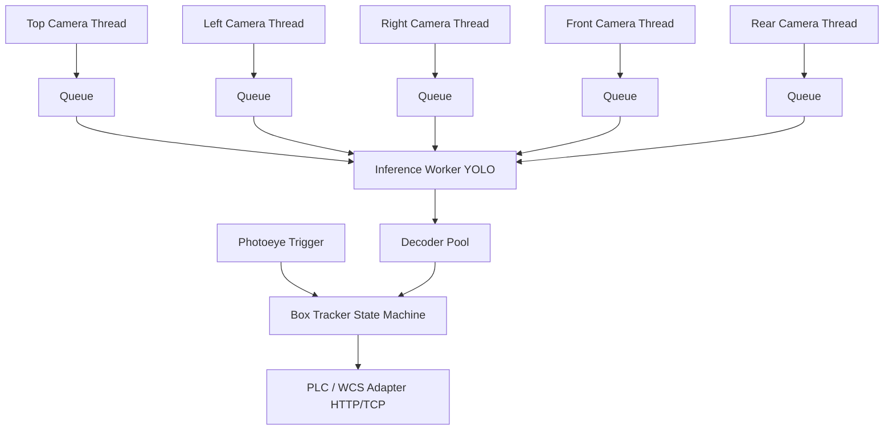

# Barcode Conveyor Reader (Production Prototype)

Асинхронная система для многокамерного считывания штрихкодов на конвейере.
Архитектура спроектирована для работы с пятью global-shutter GigE камерами, аппаратным триггером и импульсным LED-освещением.

## Архитектура системы



1. Аппаратный триггер создает новый `box_id`.
2. Пять асинхронных потоков `CameraCaptureThread` захватывают кадры.
3. `InferenceWorker` забирает кадры, выполняет батчевый/поточный инференс YOLO и находит все области со штрихкодами.
4. Вырезанные области передаются в `DecoderPool` для предварительной обработки (включая повороты на 90/180/270 градусов) и декодирования с помощью ZBar/pyzbar.
5. Результаты агрегируются в `BoxContext`, дедуплицируются и отправляются в PLC до достижения коробкой сортера.

## Запуск в Docker (рекомендуется)

```bash
docker-compose up --build -d
```
Стек поднимет само приложение и мок-сервер для приема данных от PLC (на порту 8080).
Конфигурация пробрасывается из `./configs/system.yaml`.

## Оптические расчеты и датасет (Памятка)

- **Датасет**: Соберите минимум 3,000-5,000 кадров с реального конвейера (не из интернета). Обязательно включите пустые грани ("hard negatives"). Разделяйте train/val/test строго по физическим коробкам, а не по случайным кадрам.
- **Освещение**: Используйте стробоскопическое освещение, чтобы сократить выдержку до ~0.3 мс (смаз 0.3 мм при скорости 1 м/с).

## Обучение модели

```bash
python -m venv .venv
source .venv/bin/activate
pip install -r requirements.txt

bash training/train.sh
bash training/export.sh
```

## Тестирование

Логика ассоциации коробок и дедупликации покрыта юнит-тестами. Запустить тесты можно так:
```bash
PYTHONPATH=. pytest tests/
```
